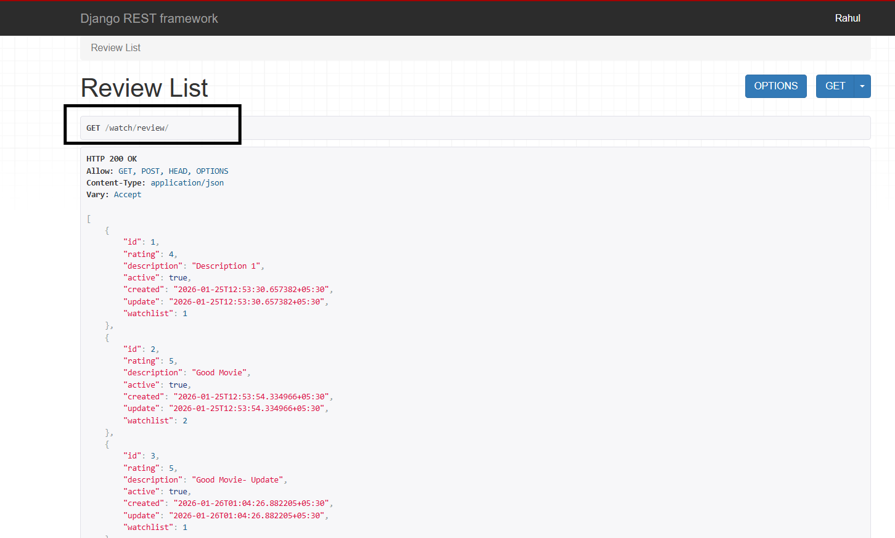
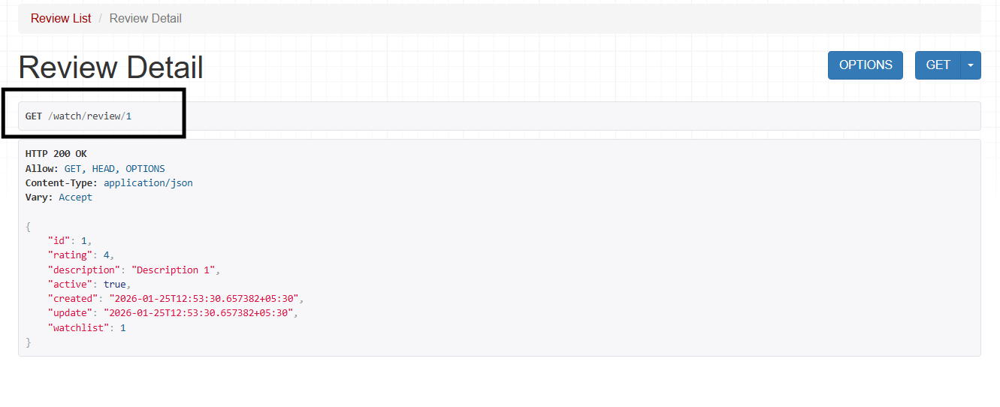

[<<Serializer Relation](./serializer_relation.md) | 

# [GenericAPIView and Mixins](https://www.django-rest-framework.org/api-guide/generic-views/)

<i>Generic Views are pre-built DRF views that automatically handle common API logic like GET, POST, PUT, DELETE. Instead of writing the same code again and again, DRF says:</i>

<b>“Here, take this ready-made view, just tell me which model and which serializer.”</b>

## [Mixins](https://www.django-rest-framework.org/api-guide/generic-views/#mixins):
It is usend when we perform a common task supper fast.

### views.py
```python
from rest_framework import mixins
from rest_framework import generics

class ReviewList(
    mixins.ListModelMixin, mixins.CreateModelMixin, generics.GenericAPIView
):
    queryset = Review.objects.all()
    serializer_class = ReviewSerializer

    def get(self, request, *args, **kwargs):
        return self.list(request, *args, **kwargs)

    def post(self, request, *args, **kwargs):
        return self.create(request, *args, **kwargs)
    
```
1. Always remember to import the <i>generics.GenericAPIView</i> class at the end.

2. <i>queryset and serializer_class</i> are predefined attributes, so their names cannot be changed.

### urls.py
```python
path('review/',ReviewList.as_view(),name="review-list")
```
### Review list views: 


### views.py
```python

````

### urls.py

```python
path('review/<int:pk>',ReviewDetail.as_view(),name="review-detail")
```
### Review Detail:


