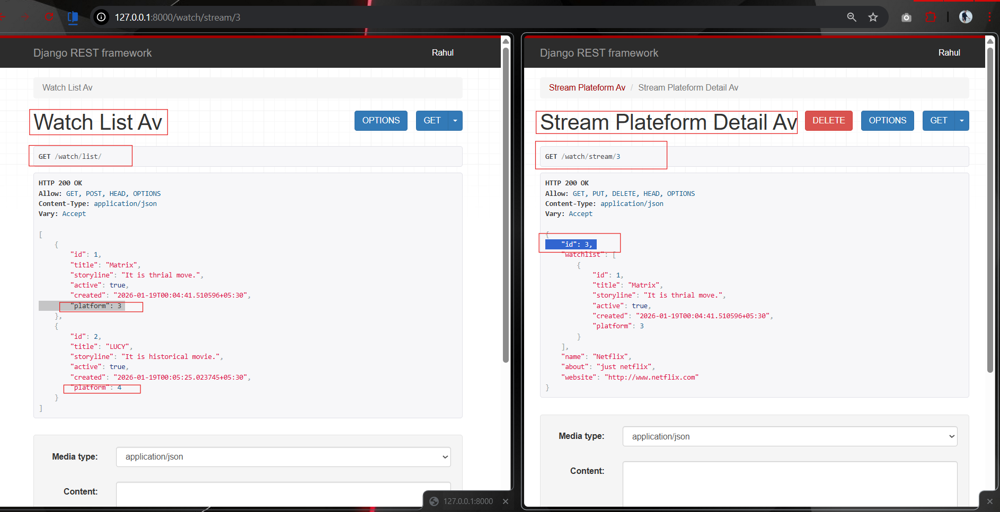
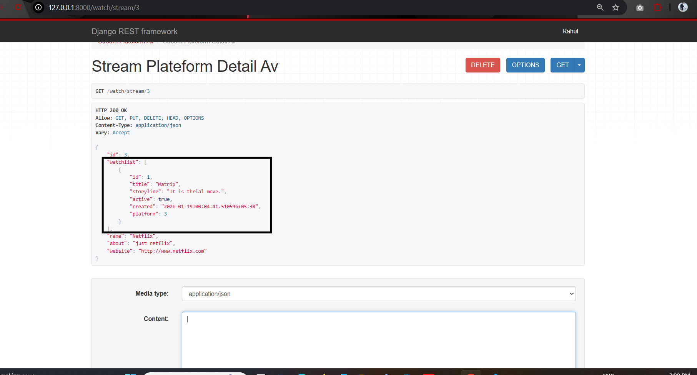
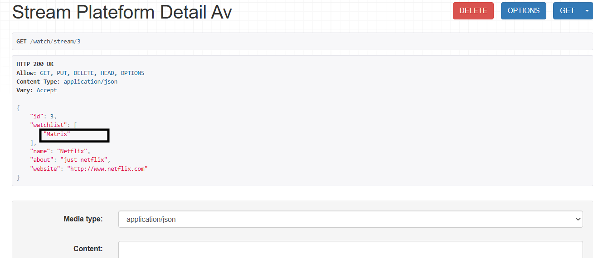
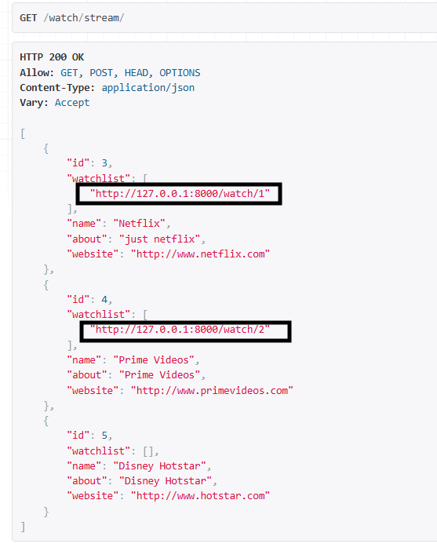

# Serializer Realation

## models.py 
```python

from django.db import models


class StreamPlateform(models.Model):
    name = models.CharField(max_length=30)
    about = models.CharField(max_length=100)
    website = models.URLField(max_length=100)
    
    def __str__(self):
        return self.name


class WatchList(models.Model):
    title = models.CharField(max_length=50)
    platform = models.ForeignKey(StreamPlateform,on_delete=models.CASCADE, related_name="watchlist")
    storyline = models.CharField(max_length=200)
    active = models.BooleanField(default=True)
    created = models.DateTimeField(auto_now_add=True)
    
    def __str__(self):
        return self.title 


```

## serializer.py

```python
from rest_framework import serializers

from watchlist_app.models import WatchList, StreamPlateform
class WatchListSerializer(serializers.ModelSerializer):
    class Meta:
        model = WatchList
        fields = "__all__"
    
    
class StreamPlateformSerializer(serializers.ModelSerializer):
    watchlist = WatchListSerializer(many=True,read_only = True)
    class Meta:
        model = StreamPlateform
        fields = "__all__"

```

## views.py
```python
from rest_framework.decorators import api_view
from rest_framework.views import APIView
from rest_framework.response import Response
from watchlist_app.models import WatchList,StreamPlateform
from watchlist_app.api.serializers import WatchListSerializer, StreamPlateformSerializer
from rest_framework import status

class StreamPlateformAV(APIView):
    def get(self, request):
        stream_plateform = StreamPlateform.objects.all()
        serializer = StreamPlateformSerializer(stream_plateform, many = True)
        return Response(serializer.data)
    
    def post(self,request):
        serializer = StreamPlateformSerializer(data = request.data)
        if serializer.is_valid():
            serializer.save()
            return Response(serializer.data)
        else:
            return Response(serializer.errors)

class StreamPlateformDetailAV(APIView):
    def get(self,request, pk):
        try:
            stream_plateform = StreamPlateform.objects.get(pk=pk)
        except StreamPlateform.DoesNotExist:
            return Response({'error': 'Not Found'},status = status.HTTP_404_NOT_FOUND)
        serializer= StreamPlateformSerializer(stream_plateform)
        return Response(serializer.data)
    
    def put(self,request,pk):
        plateform = StreamPlateform.objects.get(pk=pk)
        serializer = StreamPlateformSerializer(plateform, data = request.data)
        if serializer.is_valid():
            serializer.save()
            return Response(serializer.data)
        else:
            return Response(serializer.errors)
    def delete(self,request, pk):
        plateform = StreamPlateform.objects.get(pk=pk)
        plateform.delete()
        return Response(status = status.HTTP_204_NO_CONTENT)

class WatchListAV(APIView):
    def get(self, request):
        movies = WatchList.objects.all()
        serializer = WatchListSerializer(movies, many=True)
        return Response(serializer.data)
    
    def post(self, request):
        serializer = WatchListSerializer(data = request.data)
        if serializer.is_valid():
            serializer.save()
            return Response(serializer.data)
        else:
            return Response(serializer.errors)
        
class WatchDetailAV(APIView):
    def get(self, request,pk):
        try:
            movie = WatchList.objects.get(pk=pk)
        except WatchList.DoesNotExist:
            return Response({'error': 'Not Found.'},status=status.HTTP_404_NOT_FOUND)
        serializer = WatchListSerializer(movie)
        return Response(serializer.data)
    
    def put(self, request,pk):
        movie = WatchList.objects.get(pk=pk)
        serializer = WatchListSerializer(movie, data = request.data)
        if serializer.is_valid():
            serializer.save()
            return Response(serializer.data)
        else:
            return Response(serializer.errors,status = status.HTTP_400_BAD_REQUEST)
    
    def delete(self,request,pk):
        movie = WatchList.objects.get(pk=pk)
        movie.delete()
        return Response(status = status.HTTP_204_NO_CONTENT)


```

## urls.py
```python

from django.urls import path, include
from watchlist_app.api.views import *
urlpatterns = [
    # path('list/',movie_list,name='movie-list'),
    # path('<int:pk>',movie_detail,name='movie-detail'),
    path('list/',WatchListAV.as_view(),name='movie-list'),
    path('<int:pk>',WatchDetailAV.as_view(),name='movie-detail'),
    path('stream/',StreamPlateformAV.as_view(),name='stream-list'),
    path('stream/<int:pk>',StreamPlateformDetailAV.as_view(),name='stream-detail'),
    
]

```
## main-urls.py

```python
from django.contrib import admin
from django.urls import path, include
import watchlist_app
urlpatterns = [
    path('admin/', admin.site.urls),
    path('watch/',include('watchlist_app.api.urls')),
]
```



Currently, we are using:  
```python
watchlist = WatchListSerializer(many=True,read_only = True)
```

This configuration returns all related fields of the WatchList model in the response.


However, if we want to display only specific fields (for example, title or id) instead of all fields, we should use [serializer relations](https://www.django-rest-framework.org/api-guide/relations/) provided by Django REST Framework.

### [StringRelatedField](https://www.django-rest-framework.org/api-guide/relations/#stringrelatedfield)

StringRelatedField may be used to represent the target of the relationship using its "__ str __" method.
```python
watchlist = serializers.StringRelatedField(many=True)
```
  #### Examples:
  

  ```python
  def __str__(self):
        return self.title 
 ```
 In our <i>WatchList</i> model, we are returning title field.


### [HyperlinkedRelatedField](https://www.django-rest-framework.org/api-guide/relations/#hyperlinkedrelatedfield)

If you want to fetch links to related fields (for example, links to the movie list), you can use this.

```python
watchlist = serializers.HyperlinkedRelatedField(
        many=True,
        read_only=True,
        view_name='movie-detail'
    )
``` 
#### Examples:


